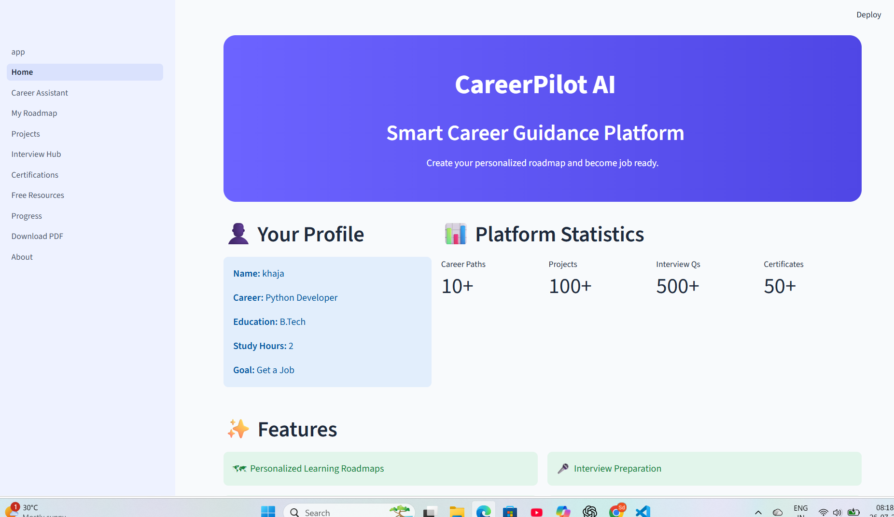
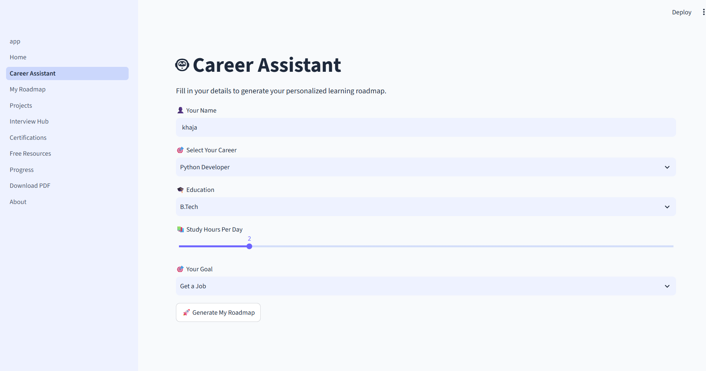
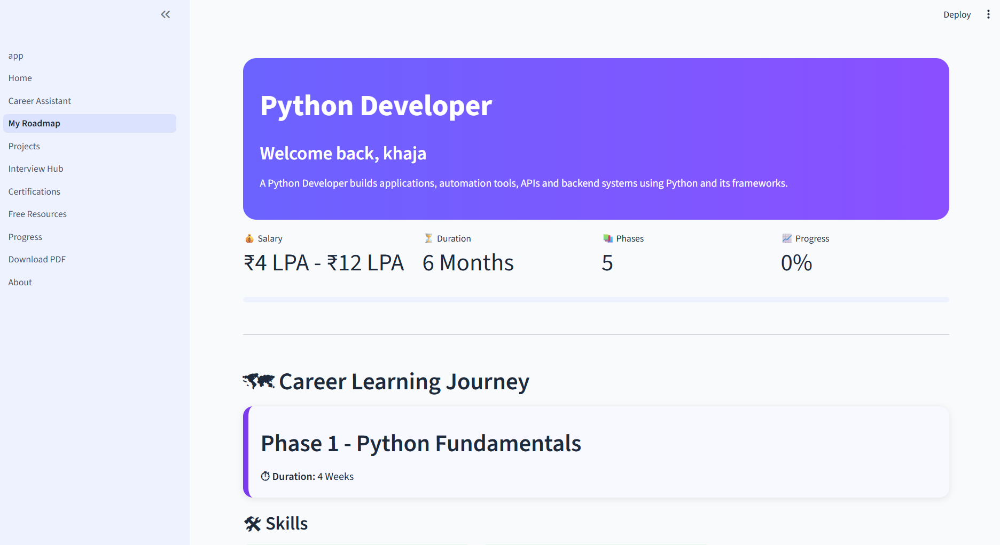
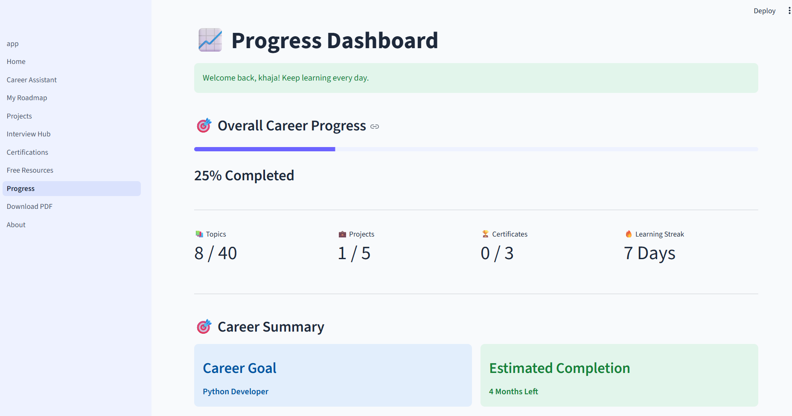
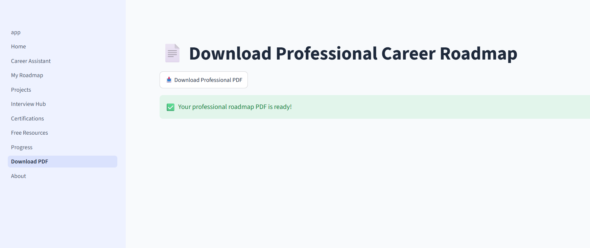

# 🚀 CareerPilot AI - AI Career Roadmap Generator


CareerPilot AI is a modern career guidance platform developed using Python and Streamlit. It helps students explore career paths, generate personalized learning roadmaps, track progress, access free learning resources, and prepare for interviews.

---

## ✨ Features

- 🎯 Personalized Career Roadmaps
- 📚 Step-by-Step Learning Paths
- 💻 Project Recommendations
- ❓ Interview Questions
- 📄 PDF Roadmap Download
- 📈 Progress Tracking
- 🎓 Free Learning Resources
- 🔐 Firebase Authentication
- 🎨 Modern User Interface

---

## 📸 Application Screenshots

### 🏠 Home Page



---

### 🤖 Career Assistant



---

### 🗺️ My Roadmap



---

### 📈 Progress Tracker



---

### 📄 Download PDF



---

## 🛠 Technologies Used

- Python
- Streamlit
- Firebase
- ReportLab
- Git
- GitHub

---

## 📂 Project Structure

```
AI_Career_Roadmap_Generator/
│
├── app.py
├── pages/
├── data/
├── assets/
├── requirements.txt
└── README.md
```

---

## 🚀 Installation

```bash
git clone https://github.com/syedjuweriyah-cse/AI-Career-Roadmap-Generator.git

cd AI_Career_Roadmap_Generator

pip install -r requirements.txt

streamlit run app.py
```

---

## 🔮 Future Improvements

- AI Chat Career Assistant
- Resume Analyzer
- Job Recommendation System
- Certification Tracker
- Dark Mode
- Multi-language Support

---

## 👩‍💻 Author

**Syed Juweriyah**

- GitHub: https://github.com/syedjuweriyah-cse
- LinkedIn: https://www.linkedin.com/in/syedjuweriyah-479a55356